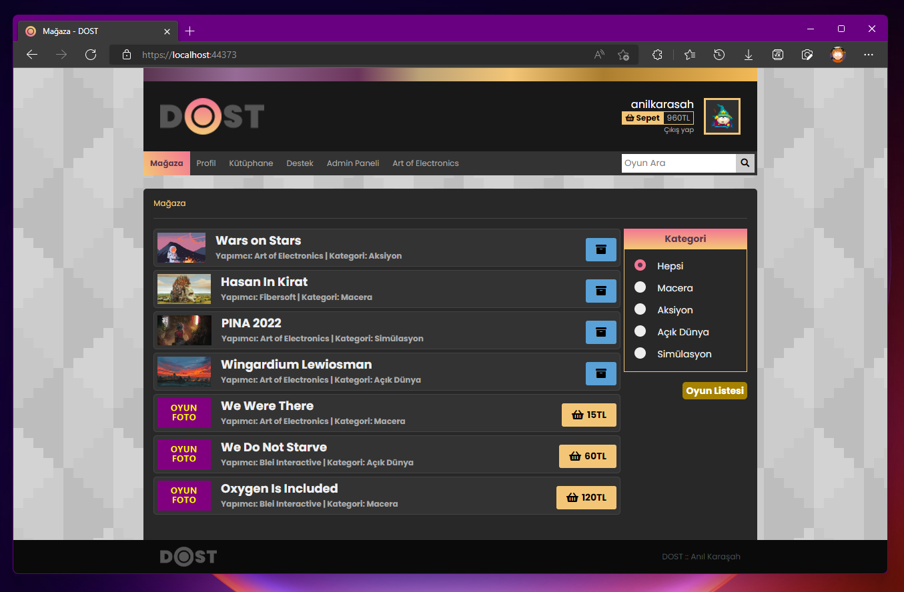

# DOSP

##### Dijital Oyun Satış Platformu

`Games in this picture and project are not real and, cannot be purchased with real money and they are not playable.`

## About DOSP

DOSP is a Steam-like platform for purchasing video games.

It is written in C# using .NET framework and MVC architecture for Back-End. And, HTML, CSS and JavaScript for Front-End. It uses Microsoft SQL as database.

#### What a user can do in this platform?

-   Create an account
-   Search for published games
-   Create support requests

#### What can a user with Developer role do?

-   Publish and remove its own games

#### What can a user with Admin role do?

-   Create new Developer accounts via linking a User with a new Developer object
-   See the list of tickets
-   Modify user/game informations
-   Create game categories

## Database

You can initialize the SQL database using the DOSP_Database_Script.sql file.
